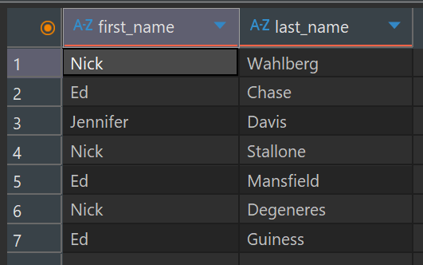
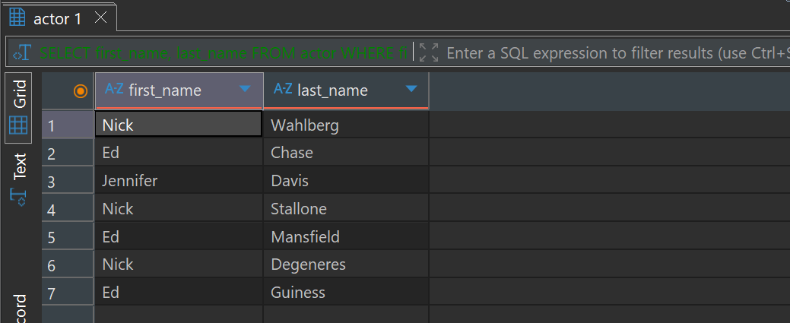
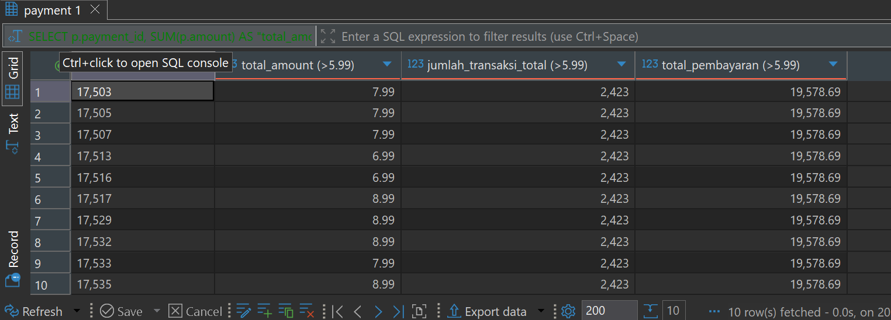
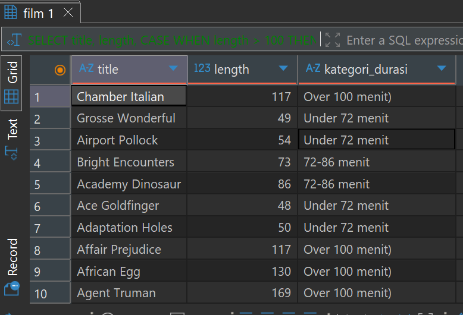
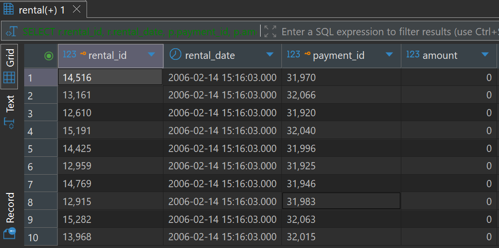
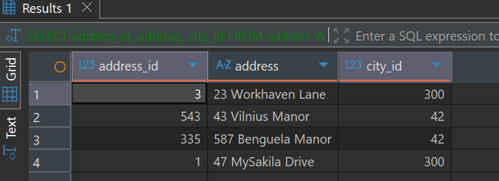

# SQL Basic Queries Portfolio Case Study

Proyek ini mendokumentasikan serangkaian **query SQL dasar** yang dibuat untuk praktik manipulasi dan pengambilan data dari dua skema database: **`dibimbing`** (pembuatan skema baru) dan **`dvdrental`** (kueri pada data yang sudah ada).

Case study ini mencakup pembuatan tabel (DDL), penyisipan data (DML), fungsi agregasi, logika kondisional (`CASE`), penggabungan tabel (`JOIN`), dan operasi set (`UNION`).

## Tools yang Digunakan
- **DBeaver**: Sebagai database management tool untuk menjalankan query SQL dan mengelola skema database.
- PostgreSQL (dvdrental): Sebagai database utama untuk case study.

---

## 1. Pembuatan Database dan Tabel Students

Bagian ini berfokus pada perintah dasar DDL (Data Definition Language) dan DML (Data Manipulation Language) untuk membuat lingkungan database dan mengisi data dengan ketentuan berikut:

1.  Membuat database bernama **`dibimbing`**.
2.  Membuat tabel **`students`** dengan skema: `id` (PK, int), `nama` (varchar), `institute` (varchar), `berat_badan` (float), dan `tinggi_badan` (float).
3.  Memasukkan minimal 5 data ke dalam tabel `students`.

### Query
```sql
-- Membuat database
CREATE DATABASE dibimbing;

-- Membuat table
CREATE TABLE students (
    id INT PRIMARY KEY,
    nama VARCHAR(100),
    institute VARCHAR(100),
    berat_badan FLOAT,
    tinggi_badan FLOAT
);

-- Insert value
INSERT INTO students (id, nama, institute, berat_badan, tinggi_badan)
VALUES
(1, 'Ayman Ahnaf', 'Universitas Muhammadiyah Yogyakarta', 65.5, 172.0),
(2, 'Nadia Putri', 'Universitas Indonesia', 54.2, 160.3),
(3, 'Rizky Pratama', 'Institut Teknologi Bandung', 70.8, 178.4),
(4, 'Siti Nurhaliza', 'Universitas Airlangga', 49.7, 158.9),
(5, 'Dimas Saputra', 'Universitas Gadjah Mada', 80.1, 182.5);

select * from students;
```
### Screenshot



## 2. Query Data pada Skema `dvdrental`

Bagian ini berfokus pada pengambilan dan analisis data menggunakan operator SQL standar dan lanjutan.

### 2.1. Memilih Aktor Tertentu

Menampilkan `first_name` dan `last_name` dari aktor yang memiliki `first_name` **"Jennifer", "Nick", atau "Ed"**.

### Query
```sql
SELECT first_name, last_name
FROM actor
WHERE first_name IN ('Jennifer', 'Nick', 'Ed');
```
### Screenshot


## 2.2. Agregasi dan Subquery
Menghitung total pembayaran (`amount`) untuk setiap `payment_id` yang lebih besar dari 5.99. Query ini menggunakan fungsi agregasi (SUM) dan subquery untuk menampilkan total transaksi dan total pembayaran keseluruhan yang memenuhi kriteria.

### Query
```sql
SELECT 
    p.payment_id,
    SUM(p.amount) AS "total_amount (>5.99)",
    (SELECT COUNT(*) FROM payment WHERE amount > 5.99) AS "jumlah_transaksi_total (>5.99)",
    (SELECT SUM(amount) FROM payment WHERE amount > 5.99) AS "total_pembayaran (>5.99)"
FROM payment p
WHERE p.amount > 5.99
GROUP BY p.payment_id;
```
### Screenshot


## 2.3. Pengelompokan Data dengan CASE
Mengelompokkan film berdasarkan durasi (`length`) ke dalam 4 kategori menggunakan statement `CASE`.

### Query
```sql
SELECT 
    title,
    length,
    CASE
        WHEN length > 100 THEN 'Over 100 menit)'
        WHEN length BETWEEN 87 AND 100 THEN '(87-100 menit)'
        WHEN length BETWEEN 72 AND 86 THEN '72-86 menit'
        WHEN length < 72 THEN 'Under 72 menit'
        ELSE 'Unknown'
    END AS kategori_durasi
FROM film;
```
### Screenshot


## 2.4. Menggabungkan Tabel dengan JOIN
Menggabungkan data dari tabel `rental` dan `payment` menggunakan `JOIN` berdasarkan `rental_id`. Hasil diurutkan berdasarkan `amount` secara *ascending*.

### Query
```sql
SELECT 
    r.rental_id,
    r.rental_date,
    p.payment_id,
    p.amount
FROM rental r
JOIN payment p ON r.rental_id = p.rental_id
ORDER BY p.amount ASC;
```
### Screenshot


## 2.5. Operasi Set dengan UNION
Menggabungkan alamat (`address`) dari tabel address yang memiliki `city_id` **42** dengan yang memiliki `city_id` **300** menggunakan operator `UNION`.

### Query
```sql
SELECT 
    address_id,
    address,
    city_id
FROM address
WHERE city_id = 42
UNION
SELECT 
    address_id,
    address,
    city_id
FROM address
WHERE city_id = 300;
```
### Screenshot

